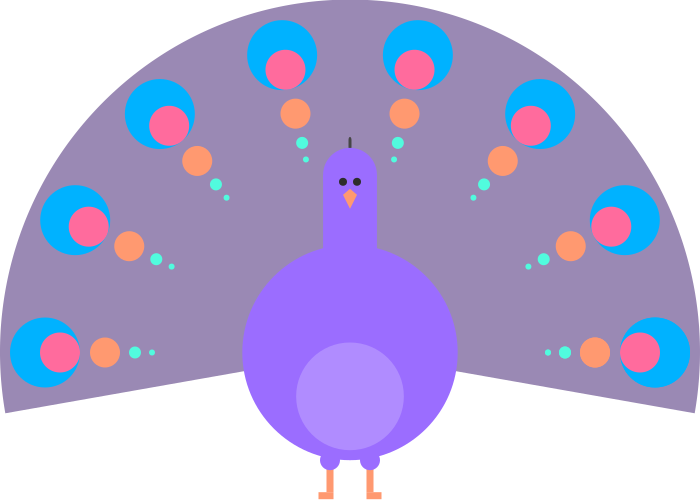

<div align="center" style="text-align: center">
  
  
  <h1>Colors convert</h1>
</div>

A simple colors library.

Using `colors-convert` you can:

- read colors in different formats
- analyze and manipulate colors
- convert colors into different formats
- give a name to a color.

## How to use

```bash
yarn add colors-convert
```

or

```bash
npm install --save colors-convert
```

## API

Different color formats are supported: hex, rgb, rgba, cmyk, hsl and hsla.

---

### 🎨 Color formats

#### Hex

A valid hex color can be:

- long format: `#RRGGBB`
- long format with opacity: `#RRGGBBAA`
- short format: `#RGB`
- short format with opacity: `#RGBA`

#### `isHex(color): boolean`

Returns `true` if `color` is a valid hex, `false` otherwise.

#### Rgb

A valid rgb color is an object like this `{r, g, b}` with `r, b, g` numeric values in range `[0, 255]`.

#### `isRgb(color): boolean`

Returns `true` if `color` is a valid rgb, `false` otherwise.

#### Rgba

A valid rgba color is an object like this `{r, g, b, a}` with `r, g, b` numeric values in range `[0, 255]` and `a` in range `[0, 1]`.

#### `isRgba(color): boolean`

Returns `true` if `color` is a valid rgba, `false` otherwise.

#### Cmyk

A valid cmyk color is an object like this `{c, m, y, k}` with `c, m, y, k` numeric values in range `[0, 100]`.

#### `isCmyk(color): boolean`

Returns `true` if `color` is a valid cmyk, `false` otherwise.

#### Hsl

A valid hsl color is an object like this `{h, s, l}` where:

- `h` (hue): `[0-359]°`
- `s` (saturation): `[0-100]%`
- `l` (lightness): `[0-100]%`.

#### `isHsl(color): boolean`

Returns `true` if `color` is a valid hsl, `false` otherwise.

---

### 🎨 Conversion

- **`hex2rgbOrRgba(hex): rgb | rgba`**: Converts a hex to a rgb or rgba color (depends on hex format)

- **`hex2rgba(hex, alpha = 1): rgba`**: Converts a hex to a rgba object

- **`hex2hexWithAlpha(hex, alpha): hex`**: Converts a hex to another hex with the given alpha

- **`hex2cmyk(hex): cmyk`**: Converts a hex to a cmyk. If hex is in the long format (e.g. #000000FF) it removes the last two chars because cmyk doens't support opacity

- **`hex2hsl(hex): hsl`**: Converts a hex object to hsl

- **`rgb2hex(rgb): hex`**: Converts a rgb object to hex

- **`rgb2cmyk(rgb): cmyk`**: Converts a rgb to a cmyk

- **`rgb2hsl(rgb): hsl`**: Converts a rgb object to hsl

- **`rgba2rgb(rgba): rgb`**: Converts a rgba color to a rgb color removing the alpha value

- **`rgb2rgba(rgb): rgba`**: Converts a rgb color to a rgba color adding 1 as alpha

- **`color2rgb(color): rgb`**: Converts a generic color (hex, rgb, rgba, cmyk, hsl) to rgb

- **`cmyk2rgb(cmyk): rgb`**: Converts a cmyk color to a rgb

- **`cmyk2hex(cmyk): hex`**: Converts a cmyk color to a hex

- **`cmyk2hsl(cmyk): hsl`**: Converts a cmyk object to hsl

- **`hsl2hex(hsl): hex`**: Converts a hsl object to hex

- **`hsl2rgb(hsl): rgb`**: Converts a hsl object to rgb

- **`hsl2cmyk(hsl): cmyk`**: Converts a hsl object to cmyk

- **`rgbString2Object(string): rgb`**: Coverts a string in these two formats to a rgb object:

  - `255, 0, 255` (short format) -> `{r: 255, g: 0, b: 255}`
  - `rgb(255, 0, 255)` (long format) -> `{r: 255, g: 0, b: 255}`

- **`rgbaString2Object(string): rgba`**: Coverts a string in these two formats to a rgba object:

  - `255, 0, 255, 0.5` (short format) -> `{r: 255, g: 0, b: 255, a: 0.5}`
  - `rgba(255, 0, 255, 0.5)` (long format) -> `{r: 255, g: 0, b: 255, a: 0.5}`

- **`cmykString2Object(string): cmyk`**: Converts a string in these two formats to a cmyk object:

  - `0, 50, 20, 100` (short format) -> `{c: 0, m: 50, y: 20, k: 100}`
  - `cmyk(0, 50, 20, 100)` (long format) -> `{c: 0, m: 50, y: 20, k: 100}`

- **`hslString2Object(string): hsl`**: Converts a string in these two formats to an hsl object:

  - `322, 79%, 52%` (short format) -> `{ h: 322, s: 79, l: 52 }`
  - `hsl(322, 79%, 52%)` (long format) -> `{ h: 322, s: 79, l: 52 }`

---

### 🎨 Name that color

- **`name(color): string`**: Given a color (hex, rgb, rgba, cmyk or hsl), it returns the name of that color. It works using a list of [18315 unique color names](https://api.color.pizza/v1/).

---

### 🎨 Utils

- **`color2string(color): string`**: Converts a color to a string format. For example:

  - hex: `#E6259F`
  - rgb: `230, 37, 159`
  - rgba: `230, 37, 159, 1`
  - cmyk: `0%, 84%, 31%, 10%`
  - hsl: `322, 79%, 52%`

- **`color2cssString(color): string`**: Converts a color to a string format usable in CSS. For example:

  - hex: `#E6259F`
  - rgb: `rgb(230, 37, 159)`
  - rgba: `rgba(230, 37, 159, 1)`
  - cmyk: `cmyk(0%, 84%, 31%, 10%)`
  - hsl: `hsl(322, 79%, 52%)`

- **`mix(colors: Color[], weights?: number[]): rgb`**: Mix two or more colors based on their weights.

Check the changelog.
